# grocery-delivery-webapp-spring
A grocery delivery web-appplication based on the Spring framework for the course Advanced-Programming.

## 1. Product bescrijving.

Een lokale supermarkt wil haar diensten uitbreiden door een online platform met bezorgservice te ontwikkelen, waarmee klanten hun boodschappen digitaal kunnen bestellen en thuis laten leveren. Deze service is bedoeld voor stadsbewoners, in het bijzonder mensen met een drukke levensstijl, zoals werkende professionals, gezinnen en ouderen, die op een gemakkelijke manier toegang willen tot verse voeding zonder zelf naar de winkel te moeten gaan. Door deze uitbreiding kan de supermarkt haar digitale aanwezigheid vergroten en een nieuwe inkomstenbron creëren, terwijl klanten tijd besparen en genieten van het gemak en de flexibiliteit van thuislevering, met blijvende toegang tot kwalitatieve en verse producten.

## 2. User story mapping
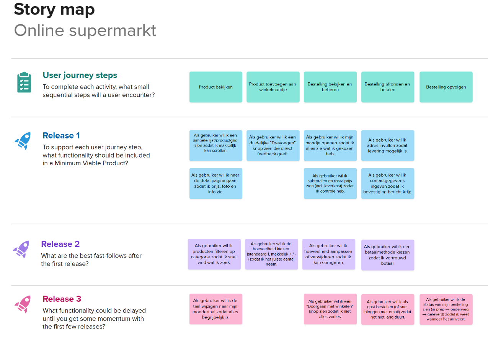
## 3. Persona's
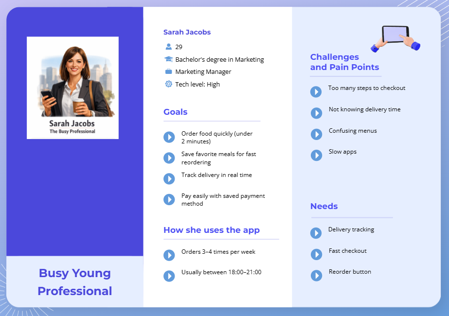
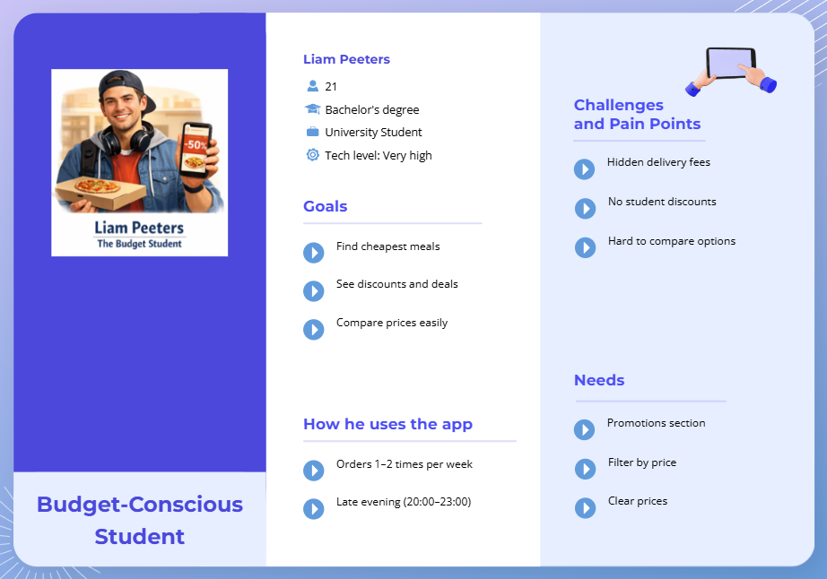
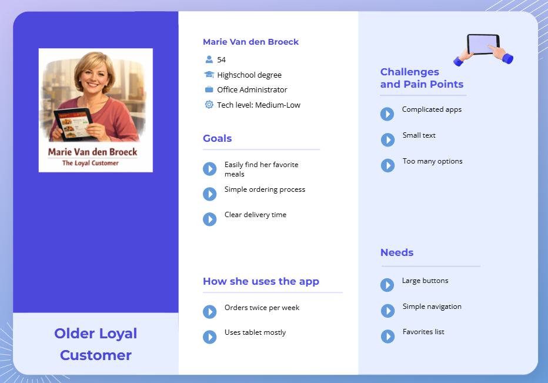
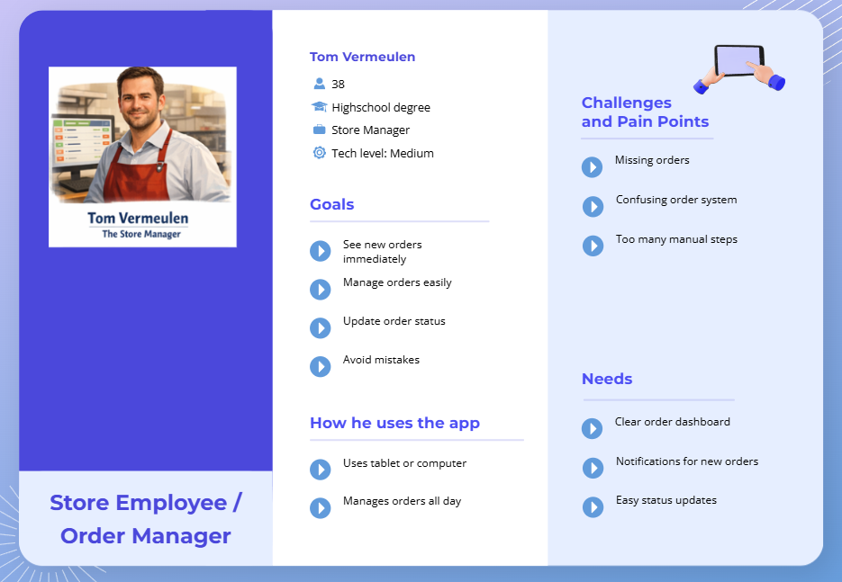

## 4. Conceptueel model
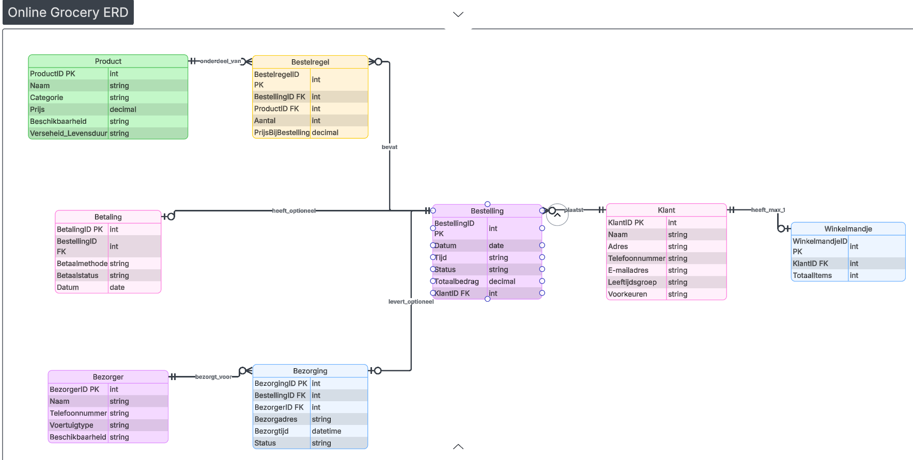
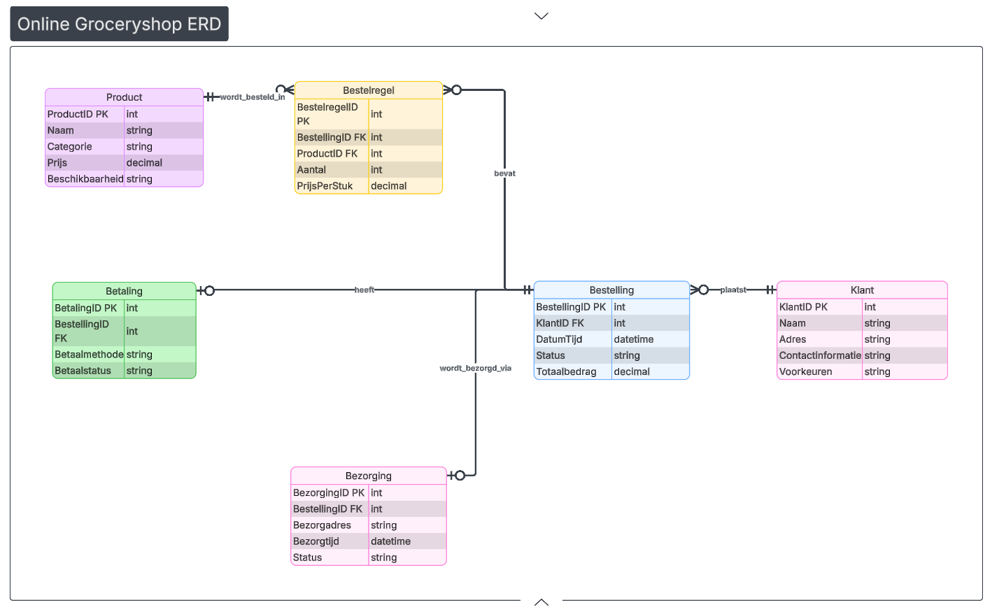

## 5. Wireframes
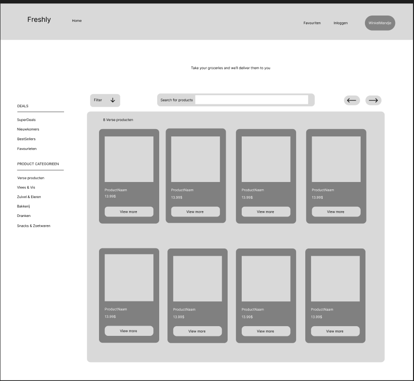
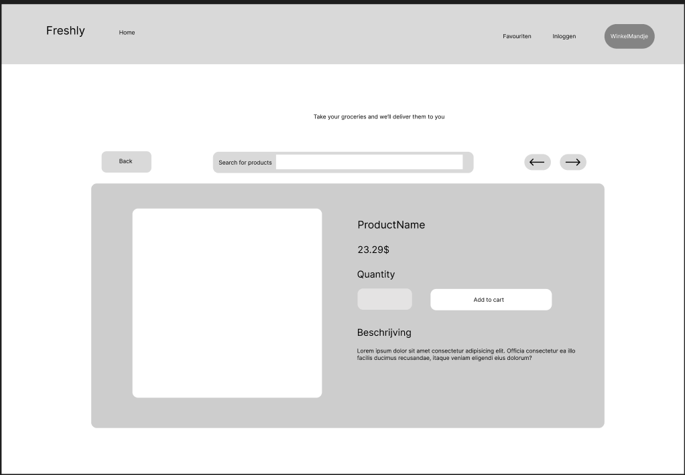

## 6. Use-case diagram
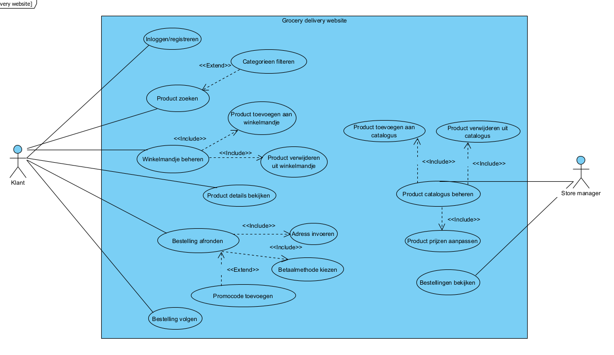

## 7. Activity diagram
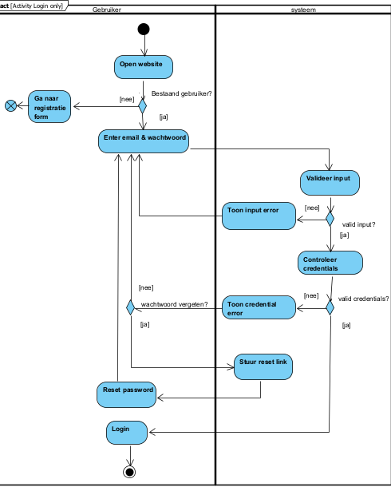
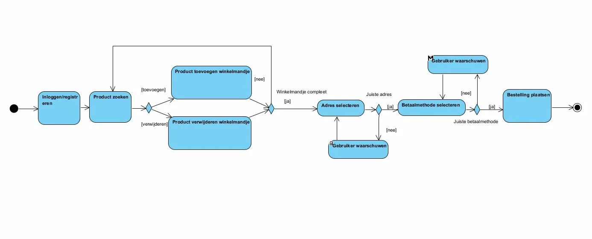

## 8. Sequence diagram
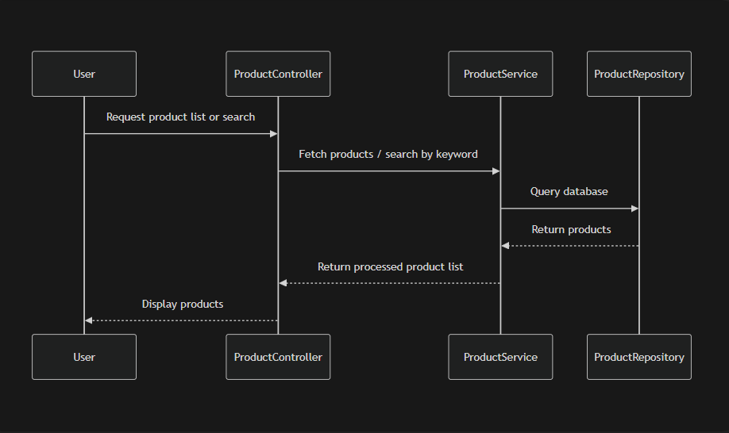

## 9. Class diagram
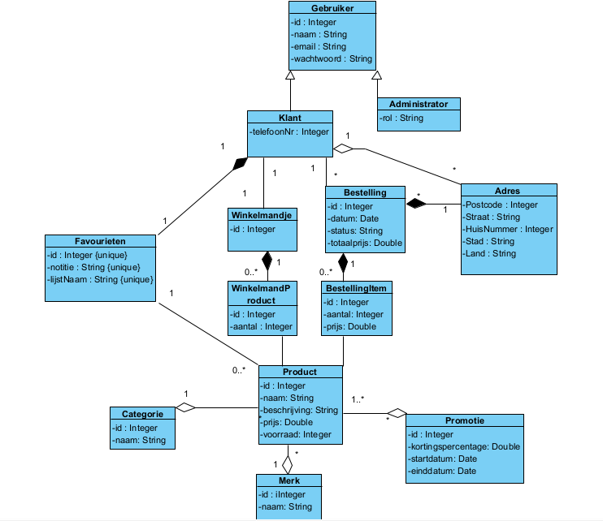
